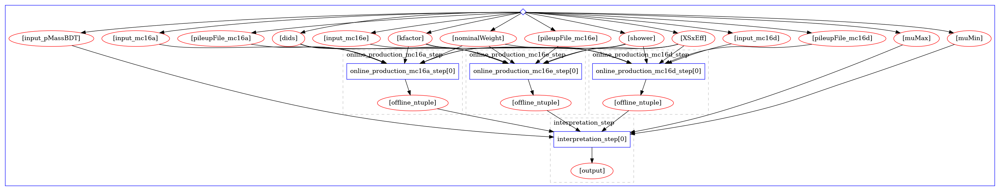

# Introduction

This repository contains the RECAST of the data analysis published in Ref. [1]. That analysis aimed to look for a new physics process in the LHC data, $t\bar tH/A \rightarrow t\bar tt\bar t$,  where $H/A$ is a new particle.

**RECAST** is a way to fully automate and preserve the analysis workflow, based on a CD/CI pipeline that takes samples of simulated events as input, preprocesses those samples, and then performs a statistical interpretation of the preprocessed samples. 

>[!NOTE]
>#### Why RECAST? 
>
> RECAST is a framework for re-using existing analyses prepared within ATLAS for subsequent publications by reinterpreting the analysis with respect to new models of physics. The approach exploits the fact that the Standard Model backgrounds of a search must only be estimated once. That is, for a reinterpretation one only needs to:
>
>- Estimate the contribution of the new physics model in the phase space regions analyzed by the experiment by re-executing the event selection code on the derivation samples produced for the new signal.
>
>- Re-execute the statistical analysis in order to determine whether the model is ruled out or not (e.g. by calculating a CLs value).

# Steps to build a RECAST

The recommended way to start preparing an analysis for RECAST is to

1. Build Docker Images for each of the software environments used in the analysis.
2. Prepare Scripts for the individual Steps of the analysis.
3. Write a Workflow Description for your analysis.

# How to use the tool?

Define the variables 

     export REANA_SERVER_URL=https://reana.cern.ch
     export REANA_ACCESS_TOKEN=<your reana token>

Run the setup script and provide the requested info:

     source setup.sh

In the recast input file, you will need to modify the following entries:

- **initdir:**   This should be the directory where you have your recast.yml file

- **input_pMassBDT:** This variable corresponds to the mass point for which the pBDT was optimised. Available mass points are 400, 500, 600, 700, 800, 900, and 1000. 

- **dids:**  your dataset id

- **XSxEff:** This is the x-section times efficiency used as input to the local TopDataPreparation file. It must be provided in picobarns. 

- **kfactor:** the kfactor of your sample

- **shower:** the showering algorithm used by your sample.

- **nominalWeight:** if you run the recast and it crashes at the online production step, it may be because the nominal weight of your sample is not included into the standard list. If this is the case, the log file will print the list of weights included in the sample. From this list you can choose the nominal weight to be used for your sample, and add it here. Please, be aware of the exact string to be used for the weight, if the weight's name has white spaces at the beginning or at the end of the string, don't remove them! The value must be provided in double quotes and within single quotes at the same time, i.e. '"my weight"'. 
- **pileupFile_mc16a /pileupFile_mc16d / pileupFile_mc16e:**  You need to check if your DSID is present in the pileup files currently used by the tool  (`dev/AnalysisTop/PileupReweighting/user.iconnell.Top.PRW.MC16a.FS.v2/prw.merged.root` and `dev/AnalysisTop/PileupReweighting/user.iconnell.Top.PRW.MC16a.AF.v2/prw.merged.root`).
  
  > If the DSID is not present, you must generate your own pileup file per mc16 campaing (this is very important, please don't merge the pileup files of all mc16 campaigns in only one file since the pileup reweighting tool does not 'see' the mc16 campaing and it will use whatever it finds in the pileup file that corresponds to the DSID, giving as a consequence a wrong pileup weight!) as described here https://twiki.cern.ch/twiki/bin/view/AtlasProtected/TopxAODStartGuideR21#9_9_CP_TPileupReweighting_ERROR .  You must provide the full path to your custom pileup files in this field. 

- **muMin:** This is the minimum value to be used by [TRexFitter](https://github.com/liboyang0112/TRExFitter) for the signal stregth.

- **muMax:** This is the maximum value to be used by [TRexFitter](https://github.com/liboyang0112/TRExFitter) for the signal stregth.

- **input_mc16a:**  the full path in EOS to the mc16a sample. 

- **input_mc16d:**  the full path in EOS to the mc16d sample. 

- **input_mc16e:**  the full path in EOS to the mc16e sample. 

> [!WARNING]
>  The RECAST for this analysis is  to be run with samples with the following tag: `DAOD_TOPQ1.e7743_a875_r<reco>_p4031`. Samples with a newer ptag will make the online production step to crash. 

Once you have done the proper changes in your `recast.yml` file, you can just submit your job to the [REANA](https://reana.cern.ch/) cluster with the following command:

       recast submit analysis/ttH4tSSML --backend reana --tag  <your_tag>

The workflow will output the full folder of results as provided by [TRexFitter](https://github.com/liboyang0112/TRExFitter) with name  **recast_output**. You can download the full folder from REANA to check your results with the following command:

       reana-client  download -w recast-<your_tag> interpretation_step/recast_output

# Official results obtained with this tool

1. ATLAS Collaboration, *Search for* $t\bar tH/A \rightarrow t\bar tt\bar t$ *production in the multilepton final state in proton–proton collisions at* $\sqrt{s}=13$ *TeV with the ATLAS detector*, [JHEP 07 (2023) 203](https://inspirehep.net/literature/2175533).
